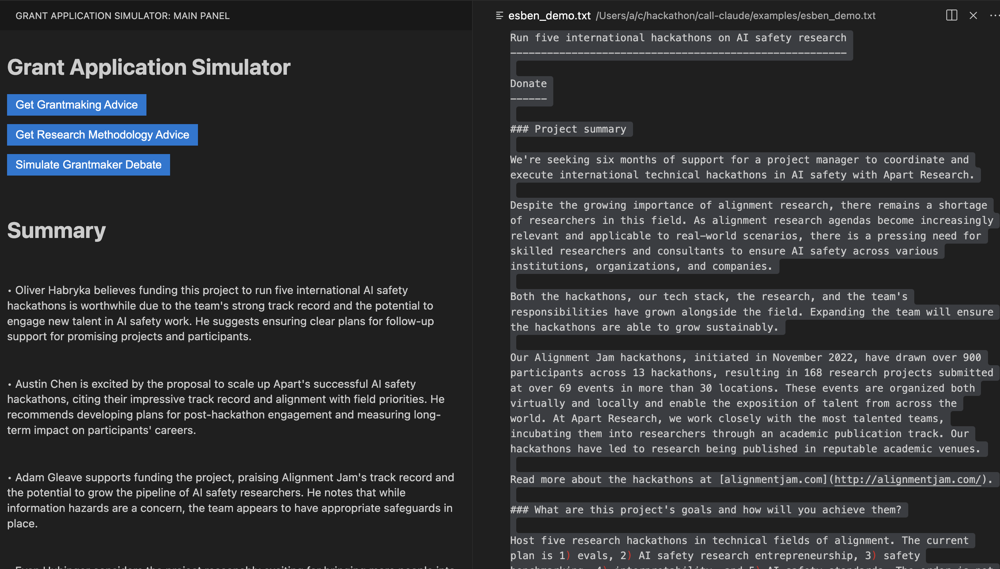
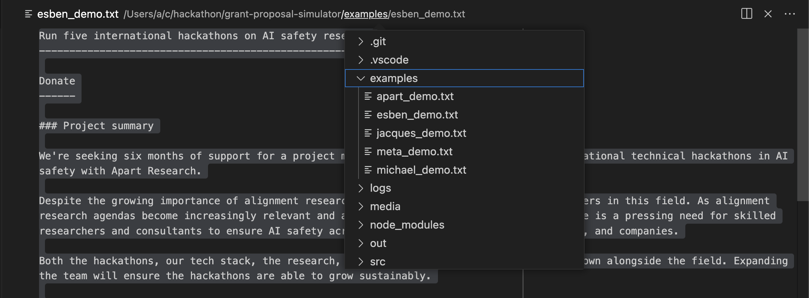

# grant-application-simulator



Disclaimer: all of the screenshot or examples in this repository use simulations of what people might say about grant proposals or other text, but do not represent these poeple's views. These are only predictions generated by language models based on limited [data](src/prompts).

## Features

Three main features:
- Grantmaking Advice: simulates feedback from grantmakers (summarized, then full feedback).
- Research Methodology Advice: Alignment Researchers criticize methodology.
- Grantmaker Debate Simulation: debate between two grantmakers.

## Requirements

Requires an Anthropic API key (get one [here]([url](https://docs.anthropic.com/en/api/getting-started))).

## Installation and Debug Guide

Follow these steps to set up and debug the extension:

1. **Clone the repository:**

```bash
git clone [your-repository-url]
cd [repository-name]
```

2. **Install Node.js:**

If not already installed, download and install Node.js from https://nodejs.org/

3. **Install dependencies:**

```bash
npm install
```

4. **Compile the extension:**
```bash
npm run compile
```

5. **Open the project in VS Code:**
```bash
code . # or open . -a Visual\ Studio\ Code
```

6. **Start debugging:**

- Press F5 or go to Run > Start Debugging
- This will compile the extension and open a new VS Code window with your extension running

7. **Test the extension:**

In the new VS Code window, do Cmd+P then look for "> Grant Application Simulator: Focus on Main View"

8. **Select text:**

Select some text that you see on screen. You can select all text from Jacques proposal for the demo, or paste any text you want and select this instead.

To navigate to different files without quitting the "Grant Application Simulator" what I do is I click on "examples" inside the path of the current file and then navigate to other files from examples by clicking on them, as you can see in the screenshot below.



(This is not ideal but I haven't figured out how to do both at the same time in a more clean way yet.)

9. **Use the key features:**

The three buttons are pretty self explanatory. You can also click on stop process to stop the process. Note that this takes a couple of seconds.

10. **Troubleshooting:**

If you encounter "command not found" errors, verify that the command names in your code match those in package.json.
For issues with the Anthropic API key, use the "Reset API Key" command to set a new key.

## Known Issues

Answers are sometimes truncated.

Response time are long (more than 10 seconds), and the request timeouts are not perfectly handled.

## Trying out with different people

If you want to change the researchers or grantmakers, you should change one of these three lines in `SidebarProvider.ts` with a different name, but please make sure you also include the corresponding data (with the filename being "lowerfirstname_lowerlastname.txt") to [src/prompts](src/prompts):

```
researchers: ['Evan Hubinger', 'Adam Gleave', 'Oliver Habryka', 'Austin Chen']

researchers: ['Ethan Perez', 'Rohin Shah', 'Paul Christiano']

const debaters = ['Evan Hubinger', 'Austin Chen', 'Oliver Habryka', 'Adam Gleave']
```

Ideally the data would be about grantmaking or similar for the first and last line, and about research methodology for the middle line.

## Main files

``` bash
#Typescript
  |src/SidebarProvider.ts                  #All of the UX of the extension and features are here. Calls extension.ts
  |src/extension.ts                        #Provides core functions and the package's commands

#Javascript
  |media/main.js                           #Has some of the logic behind the buttons

#src/prompts
  |adam_gleave.txt                         #Adam Gleave Manifund comments + LTFF writeups
  |austin_chen.txt                         #Austin's Manifund comments (formatted)
  |ethan_perez.txt                         #Ethan's post on advice for alignment research + a claude summary of another post
  |evan_hubinger.txt                       #Evan's Manifund commetns + LTFF writeups
  |oliver_habryka.txt                      #Oliver's LTFF writeups
  |paul_christiano.txt                     #One post by Paul on research methodology
  |rohin_shah.txt                          #One post by Rohin about AI Alignment Research advice

#src/examples
  |apart_demo.txt                          #Text to make a demo of using the extension on Apart's Manifund proposal.
  |...

#Config files
  |package.json                            #Register the commands etc, dependencies etc.
  |launch.json                             #What to launch or open at startup (feel free to customize)
```

## Release Notes

Jul 29: releasing v0.1 for the [Research Augmentation Hackathon: Supercharging AI Alignment](https://www.apartresearch.com/event/research-augmentation-hackathon-supercharging-ai-alignment)
